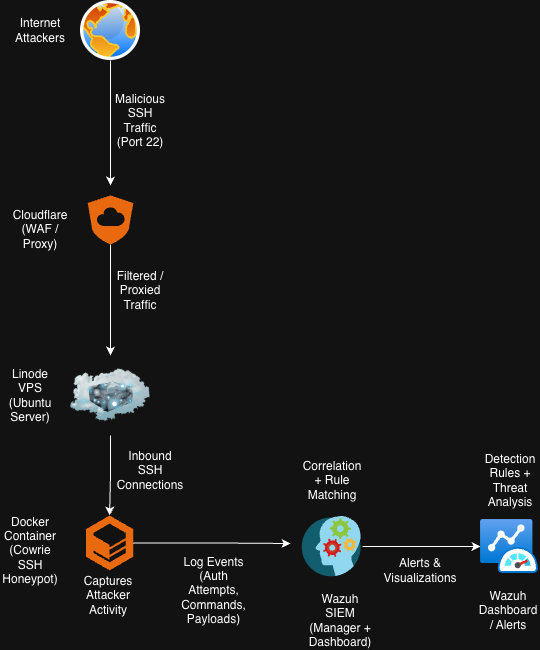
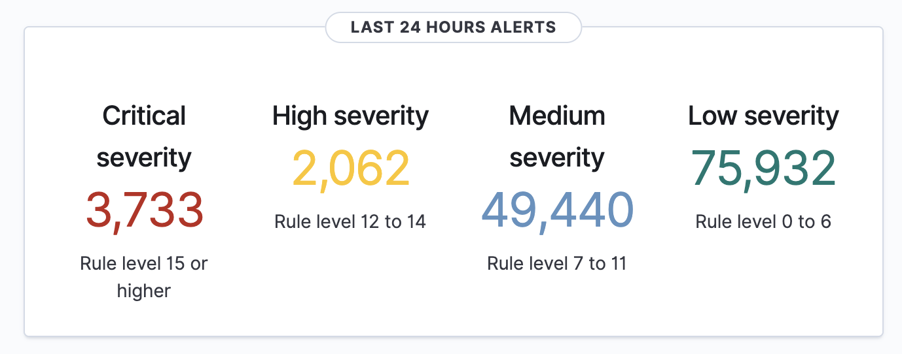
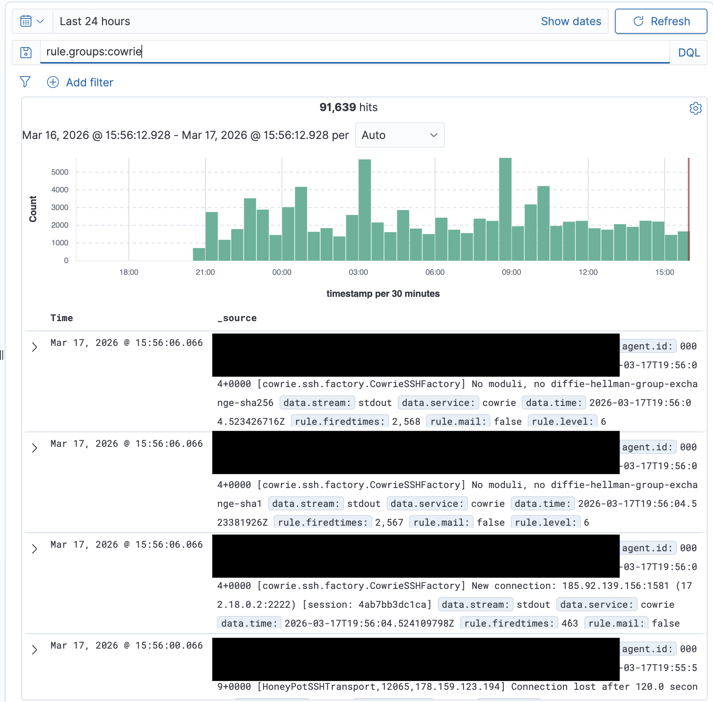
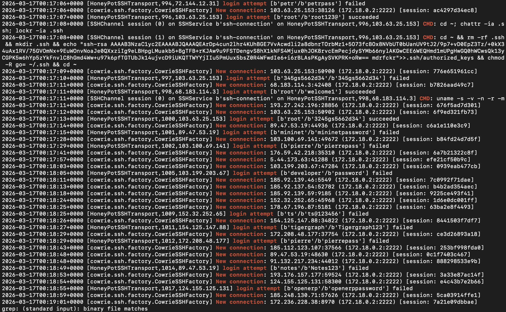
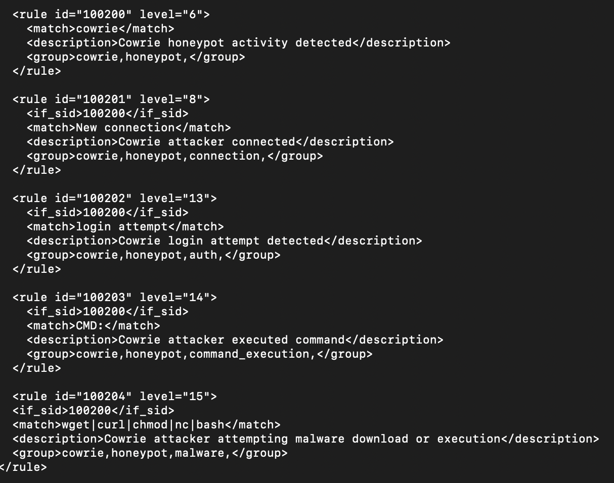
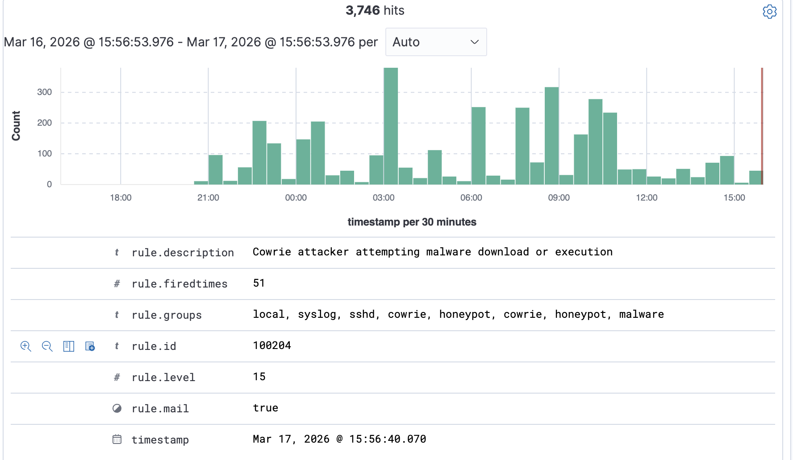

# cowrie-honeypot-wazuh
Cloud-based SSH honeypot integrated with Wazuh SIEM for real-world threat monitoring
# Cloud-Based SSH Honeypot with Wazuh SIEM Integration

## Overview
This project demonstrates the deployment of a cloud-based SSH honeypot using Cowrie, integrated with Wazuh SIEM to monitor and analyze real-world attacker activity. The environment captures live attack traffic, including brute force attempts, command execution, and potential malware activity.

## Architecture


## Technologies Used
- Wazuh SIEM
- Cowrie SSH Honeypot
- Docker
- Linode (Cloud VPS)
- Cloudflare
- Linux (Ubuntu)

## Implementation
A Cowrie SSH honeypot was deployed inside a Docker container on a cloud-hosted VPS and exposed to the internet to attract malicious SSH traffic. Logs generated by Cowrie were forwarded to Wazuh SIEM for analysis. Custom detection rules were created to identify attacker behaviors such as connection attempts, authentication failures, command execution, and malware activity. Alerts were visualized in the Wazuh dashboard for real-time monitoring.

---
## Detection Rules
```xml
<rule id="100200" level="6">
  <match>cowrie</match>
  <description>Cowrie honeypot activity detected</description>
</rule>

<rule id="100201" level="8">
  <match>New connection</match>
  <description>Cowrie attacker connected</description>
</rule>

<rule id="100203" level="12">
  <match>CMD:</match>
  <description>Cowrie attacker executed command</description>
</rule>

```

Key Findings
	•	Observed real-world brute force login attempts targeting common usernames such as root and admin
	•	Identified attacker reconnaissance behavior using commands like uname -a and cat /proc/cpuinfo
	•	Detected attempts to download malicious payloads using wget and curl
	•	Captured attacker IPs from multiple geographic regions

Skills Demonstrated
	•	SIEM configuration and log analysis
	•	Detection engineering
	•	Threat monitoring and analysis
	•	Linux system administration
	•	Cloud security deployment

Conclusion

This project demonstrates hands-on experience building and operating a SIEM-integrated honeypot environment 
to monitor real-world attacker activity. It highlights practical skills in detection engineering, 
log analysis, and threat monitoring aligned with SOC analyst responsibilities.


## Screenshots

### Dashboard


### Discover View


### Cowrie Logs


### Detection Rules


### Alerts



## Sample Alert

Example Wazuh alert triggered by malicious activity:

- Rule ID: 100204  
- Severity: 15  
- Description: Malware download attempt  
- Command: wget / curl  


## Future Improvements

- Integrate GeoIP to map attacker locations
- Implement automated IP blocking using Wazuh active response
- Send alerts to external platforms (Slack/Discord)
- Expand detection rules for advanced attacker behavior
